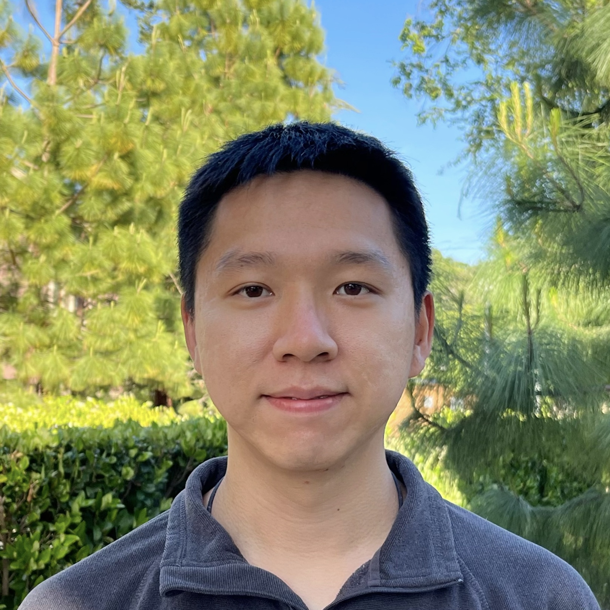

Hi there! Welcome to Tiger's home page! I'm a Postdoctoral Scholar at [Stanford Graduate School of Business](https://www.gsb.stanford.edu/), where I am so fortunate to be mentored by Prof. [Stefan Wager](https://web.stanford.edu/~swager/), [Ramesh Johari](https://web.stanford.edu/~rjohari/) and [Guido Imbens](https://gsb-faculty.stanford.edu/guido-w-imbens/). 

Previously, I received my PhD in [Statistics at Carnegie Mellon University](http://stat.cmu.edu/), where I was advised by Prof. [Edward H. Kennedy](https://www.ehkennedy.com/). Before that, I studied math and statistics at [University of Science and Technology of China(USTC)](https://en.ustc.edu.cn/).

I am broadly interested in statistical theory and methodology for causal inference, often based on semiparametric efficiency theory. Topics includes:
* Generalizability and transportability,
* Instrumental variable methods,
* Heterogeneous effects estimation,
* Continuous treatment effect (dose response) estimation,
* Causal inference in high-dimensional problems.

---

* [zhzeng@stanford.edu](mailto:zhzeng@stanford.edu)
* [github.com/Tiger-ZhenghaoZeng](https://github.com/Tiger-ZhenghaoZeng)
* [google scholar](https://scholar.google.com/citations?user=Lx5Kh6AAAAAJ&hl=en)

